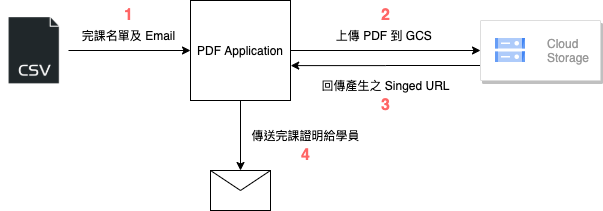

# Readme
此專案可以透過 CSV 檔接收有完成 ATP 課程之學員名單，自動製作完課證明之 PDF 並且將該檔案透過雲端連結以及 Email 傳遞給完課之學員

## Basic Component
1. **主程式碼**：certification_email_generator.ipynb 內含所有程式碼，請用 Jupyter Notebook 開啟
2. **templates資料夾** : 所有 Template 儲存之位置
3. **service_account 資料夾** : 存放證書上傳至 GCS 所需得 Service Account 
4. **tmp 資料夾**: 在產生證照後暫存檔會放在 tmp，請定期自行清除 tmp 內檔案
5. **fonts 資料夾**: 擺放產生證照時使用的特殊字體檔，此檔案夾請勿異動
6. **diagram 資料夾**： 存放說明用架構圖

## 寄信完整流程說明：

1. 完課學員名單透過 CSV檔讀取到程式中
2. 程式將名單一個個製作成完課證明的 PDF 檔並且透過 Email 做密碼鎖加密，最後將上鎖的 PDF 完課證明檔案上傳到 GCS
3. 上傳到 GCS 後，程式會跟 GCS 索取可以讓學員下載用的 Signed-URL，目前設定此 Singed-URL Valid 7 天
4. 程式最後會將完課證明連結(Signed-URL)透過 Email 發送給學員

